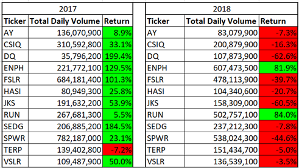
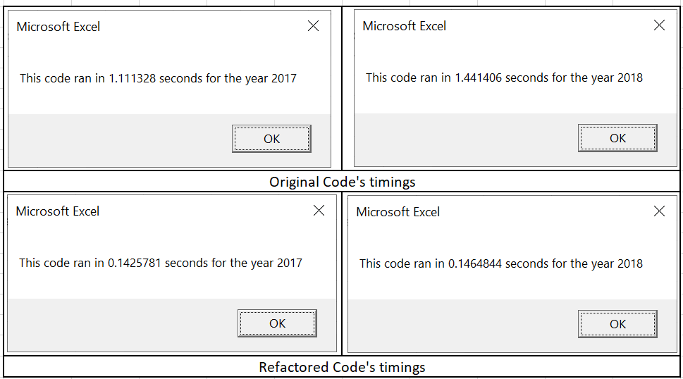
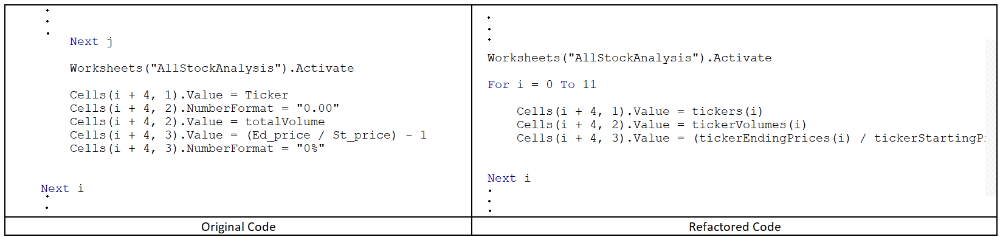

# Stock-analysis
# Overview
Steve’s parents are looking to invest their money into renewable energy stocks. They have already decided to invest into DAQO energy corps. However, as a financial expert, Steve is looking to do some first-hand analysis on the clean energy stocks data to ensure that his parents are making informed decision. To assist Steve, we will be simplifying the data and tabulating it into senseful information such as total volume traded in a year and return percentage over the year. This will help Steve and his parents to compare each stocks and make informed decision on choosing a particular stock for maximum gain.

## Purpose
The purpose of this study to understand the performance of each company’s stock over the year. We shall be calculating yearly performance by measuring total trade for the given years and analyse yearly return percentage of the stocks.

# Results
## Analysis of Stocks Data

Image 2.2.1 Renewable Energy Stocks Performance 2017 Vs 2018

It is quite evident from above table that 2017 was much better year for the renewable energy stocks than 2018 as all the comanies were in green for returns except one. TERP is the only one stocks which has given negative returns for both the years. As per the first choice of Steve’s parents, DQ has also not done pretty well in 2018. Returns are above average in 2017 but if we closely look at the total volume traded than it is very low, comes around 1% of the total trade happened for the entire renewable energy shares. Hence, it is not advisable to go with DQ, because the money will be at high risk and less returns.

There are 2 shares ENPH and RUN, have performed consistently well for both of these years. The one which stands out is ENPH, as it has done considerably well in 2017 and 2018. As far as the traded volume is considered, in 2017 it was around 7% of the total share traded and in 2018, it is the highest traded stock around 18% of all the stocks traded for renewable energy companies. As per the available data and the return value, ENPH is the best performing stocks out of all the renewable energy stocks.

## Analysis of code execution

Image 2.2.2 Timings of different versions of VBA code for Stock Analysis

Clear winner in the 2 versions of code we ran is the refactored code. It comes out to be more efficient in terms of the timings. Analysis for both of the year took similar time for each set of the code, but there was big difference between execution time of original code versus refactored code. As per above screenshots the timings for refactored code were cut down by 89% from original code for whole analysis (Timings for both years combined). Whereas upon running the code for few times, the average time reduction is around 88% for the refactored code. 

Image 2.2.3 Differences in the versions of code for stock analysis

Primary change we did in refactored code is to store values of final outcomes in arrays. Hence it gave us advantage to output the data on spreadsheet once the calculation is done. Although, we have used a separate loop to output the data to sheet, it has still reduced the execution time for the refactored code. The reason behind the reduced timings is cutting down time for macro to switch between the sheets. In refactored code, macro need not to switch to different sheets for every single iteration, cutting down the wastage resulting into reduced execution time. 

## Conclusion
Stock Analysis: ENPH is the better stock to be considered for the investment purpose, because it has consistently performed for both of the year and with considerable credibility.

Code Analysis: Refactored script is faster and more efficient as compared to the original code, because the code is cleaner (reduced wastage) and more analysed.

# Summary
## Advantages and Disadvantages of Refactoring
Refactoring is to revisit the code and enhancing the efficiency of the code while keeping the functionality constant.

Refactoring the code is an important step for a programmer. It gives another eye or another look to the code and helps to make it more efficient by reducing the wastage and clutter in the code. Revisiting means rethinking your own logics as a whole and hence helps to remove any unnecessary length of code or any redundant code to enhance the efficiency. During the process of refactoring, as we align the code, it also helps to test the code in multiple dimensions and uncover bugs. 

Although, refactoring sounds fantastic for programming, but it comes with cost. It requires more time to finalize a code and hence have to be factored in advance, during the planning phase. This increases overall timeline of project and hence the budget too. If the refactoring is done in hurried manner, then it may spoil the code and add bugs instead improving the code. Hence refactoring has to be handled with care and can provide wonderful outcomes if planned properly. 

Finally, just to enumerate following are few advantages of refactoring

  •	It reduces clutter (wastage) in the code and hence make it more clean

  •	Enhances efficiency of the code viz. works faster by replacing any duplicity or long code

  •	Helps to find bugs and fixing them

  •	Makes the code more streamlined and more readable

Refactoring also have certain disadvantages as mentioned below:

  •	It increases timing for coding and adds to project cost

  •	Rushed refactoring or less testing may introduce bugs in code

## Pros and Cons applicability to Refactoring of original VBA code
As any other code for VBA code what we processed, the refactoring benefits are equally applicable with the cost associated. As we refactored the code, we identified that since we are outputting the results after every iteration, it generates a need for the macro to switch between the sheets. As per our experience it is always a task when we have to toggle between different sheets as we work manually. Macro has no difference, it also takes time to toggle between sheets, although in fraction of seconds but still a loss. We replaced the output variable to array and stored the outcomes in variable for the iterations, and once the calculations are done, we ran a loop to output data to the sheet. This increased the efficiency of code by removing the time for macro to switch between sheets. 

Similarly, I realised in my original code as it was a learning example, I was formatting the code at 2 different places and that was a redundant task. In the refactored code, I kept the formatting of output at one place and one time and helped my code clutter free, streamlined and readable.

While, refactoring did wonders for my code execution time as I was able to reduce it by 88%, but it took good amount of time to refactor the code. I have to rebuild the code to make sure the changes in output are not adding any bugs to the code. The variables are changed and hence I had to test my code a few little times to get to the correct output as iteration index was to be set properly for the array variables. Hence it is very important for the refactored code to be tested rigorously and make code more efficient. 

